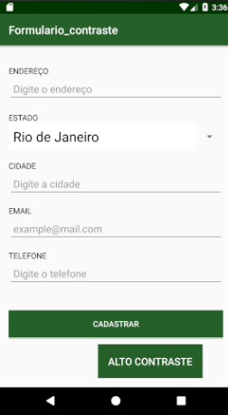

# Formulario com contraste
Projeto que demonstra os princípios do Material design, principalmente no que se refere a acessibilidade. Usado originalmente para um projeto de faculdade. Projeto não possui uma lógica de programação.

*Para mais informações [Android accessibility](https://developer.android.com/guide/topics/ui/accessibility/apps.html#label-ui)*

## Screenshots
Tela inicial.

Tela com contraste de cores

## Detalhes
+ Princípios do design de interfaces.
+ Uso de Material design.
+ Uso dos conceitos de acessibilidade.
+ Opção para alto-contraste.
+ Fontes legíveis.
+ Textos claros.
+ Uso de Hints.
+ Uso de descrições.

## Requisitos
(breve)

## Licença
Sob uso da [MIT Licença](https://github.com/Nabucodono5or/Formulario_contraste/blob/master/LICENSE)
